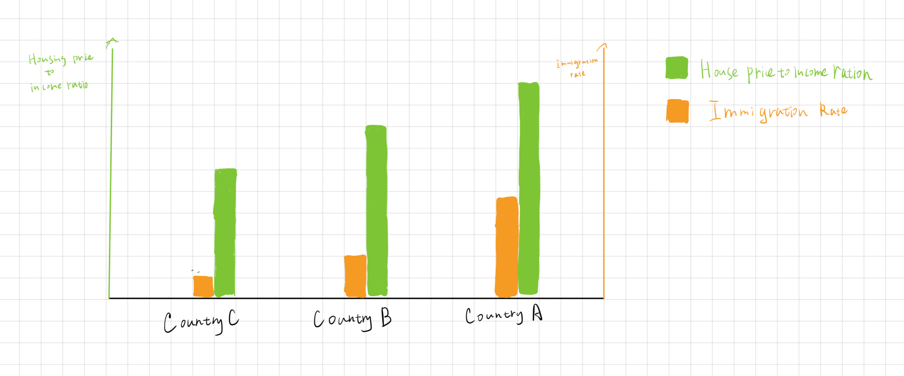
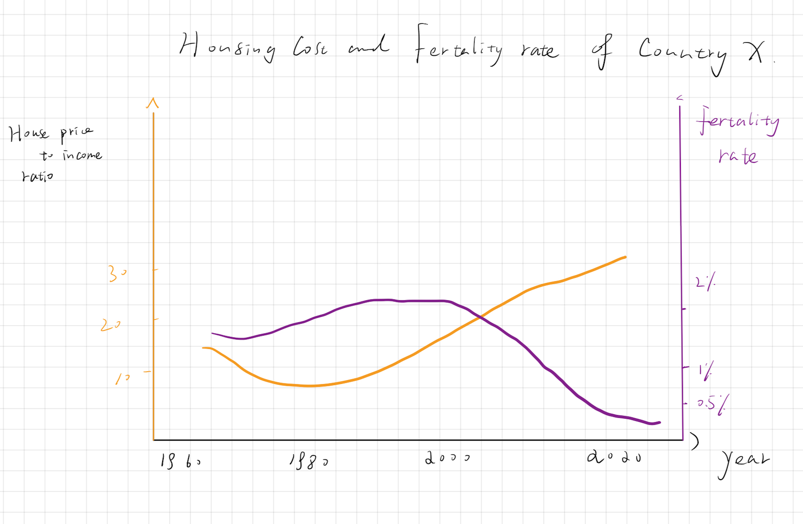
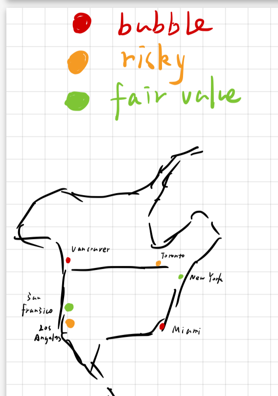

| [home page](README.md) | [visualizing debt](visualizing-government-debt) | [critique by design](critique-by-design) | [final project I](final-project-part-one) | [final project II](final-project-part-two) | [final project III](final-project-part-three) |

# Outline

This project aims to provide a comprehensive visualization of the housing bubble and its consequential impact on demographic trends. Housing costs, an essential aspect of living, have escalated to levels that appear unsustainable when contrasted with average income levels across numerous markets. This disparity raises concerns about its broader implications on both the economy and society at large.

A key metric in evaluating housing affordability is the housing-to-income ratio, which offers insights into whether housing costs are disproportionately high relative to people's earnings. It is posited that the burden of elevated housing expenses plays a significant role in influencing key life decisions, including family planning and migration patterns. 

To address these challenges, this project will delve into the dynamics of the housing market, examining the intricate relationship between housing affordability and its effects on population movements and growth. By leveraging data on the housing-to-income ratio alongside migration and fertility trends, I aim to uncover the nuanced ways in which the housing bubble influences decisions on migration and family expansion.

The analysis will not only shed light on the current state of the housing market but also offer valuable insights for policymakers, urban planners, and individuals alike, seeking to understand and navigate the complexities of housing affordability. Through this exploration, I aspire to contribute to a more informed dialogue on sustainable housing policies and practices that can support balanced economic and social development.

### Story arc

I initiate the narrative with a captivating statistic or question designed to spark curiosity, laying the groundwork for a comprehensive exploration. This uses a bar chart that unveils the startling reality of widespread housing pressures faced by many.

Following this, I introduce a line plot that juxtaposes the rising housing bubble against the declining fertility rate in Eastern Asian countries, a juxtaposition that serves to deepen the emotional engagement of the audience by highlighting a concerning trend.

Next, a geographic heat map illustrates the relationship between housing costs and migration patterns, emphasizing the movement of people in a way that is likely to leave a lasting impression on viewers.

Collectively, these visual elements weave a poignant narrative, aiming to heighten public awareness and catalyze policy reforms addressing the critical issue of housing affordability. Through this carefully constructed storyline, my goal is to not only inform but also inspire action towards alleviating the housing crisis.

## Initial sketches
> Post images of your anticipated data visualizations (sketches are fine). They should mimic aspects of your outline, and include elements of your story.  

In this part, I present 3 sketches I plan to further implement.  

1. A bar chart illustrating the rankings of housing costs and emmigrant numbers for each country, fostering an initial comprehension of how these factors interrelate. This visualization serves as a foundational step towards understanding the broader implications of housing affordability on migration patterns.

2. A line plot for a specific Eastern Asian country, "Country X", showcasing two distinct trends: the evolution of housing costs and the fertility rate over time. This visualization could reveal a startling correlation, indicating that as the housing bubble expands, there's a notable decline in the population's willingness to have children, underscoring the socioeconomic pressures influencing family planning decisions.

3. A geographical heat map detailing the house price-to-income ratio juxtaposed with the volume of migration. This map aims to visually represent the hypothesis that escalating housing costs are not merely a financial concern but a significant factor prompting individuals to relocate, potentially highlighting regions where the affordability crisis is most acute and its impact on population movement.

# The data

For the initial phase of our analysis on the relationship between housing costs and immigration, I will leverage data from reputable institutions, including governmental bodies and globally recognized organizations. This approach ensures accuracy and reliability. Below is the description of the data sources utilized:

Official Census and Statistics Departments of Each Country/Region: Each country's statistics office collects data through censuses, surveys, and other research methods, offering insights into housing, population dynamics, and immigration trends. This data is authoritative, as it is collected and published by national governments, ensuring high standards of reliability and comprehensiveness.

Our World in Data: A project of the Global Change Data Lab, a registered charity in England and Wales, Our World in Data presents research and data to make progress against the world’s largest problems. It compiles and curates data from various sources, including international organizations, academic institutions, and government bodies, making it a valuable resource for global trends in economics, environmental science, health, and technology. The platform is known for its rigorous data documentation and accessibility, making complex issues understandable through data visualization.

Numbeo: Numbeo is the world’s largest database of user-contributed data about cities and countries worldwide. It provides current information on cost of living, housing indicators, perceived crime rates, and quality of healthcare, among other statistics. The data on Numbeo is generated by its users and gives a grassroots view of living conditions, including comparative housing costs across different regions. While it may not have the same level of official sanction as government data, Numbeo's broad user base contributes to a diverse and comprehensive dataset that is useful for comparing everyday living expenses.

| Name | URL | Description |
|------|-----|-------------|
|  Numbeo    |  https://www.numbeo.com/property-investment/rankings.jsp   | Numbeo is a Serbian crowd-sourced online database of perceived consumer prices, real property prices, and quality of life metrics. The website was founded in April 2009 by former Google employee Mladen Adamović, to enable users to share and compare information about the cost of living between countries and cities.           |
| Our World in Data     | https://ourworldindata.org/migration    | Our World in Data is a scientific online publication that focuses on large global problems such as poverty, disease, hunger, climate change, war, existential risks, and inequality.  |
| Official Census and Statistics Department of Each Country / Region, e.g., United States Census Bureau |  https://www.census.gov/acs/www/about/why-we-ask-each-question/housing/   | The United States Census Bureau, officially the Bureau of the Census, is a principal agency of the U.S. Federal Statistical System, responsible for producing data about the American people and economy  |

Utilizing these data sources, I aim to establish a foundational understanding of the relationship between housing costs and immigration patterns, ensuring my story is grounded in credible and diverse datasets. This multifaceted approach allows for a robust examination of how housing affordability and availability influence migration decisions on a global scale.

# Method and medium
To develop an interactive data dashboard, I intend to use Tableau for crafting the visualizations. The primary plots I aim to feature include bar charts, line plots, and geographic heat maps, all of which are seamlessly achievable within Tableau. Integrating these visually appealing and informative visualizations into my GitHub page will not only enhance the presentation but also facilitate a more engaging and interactive user experience. Tableau's capabilities in handling complex datasets and transforming them into clear, interactive visual narratives make it an ideal tool for this project.

